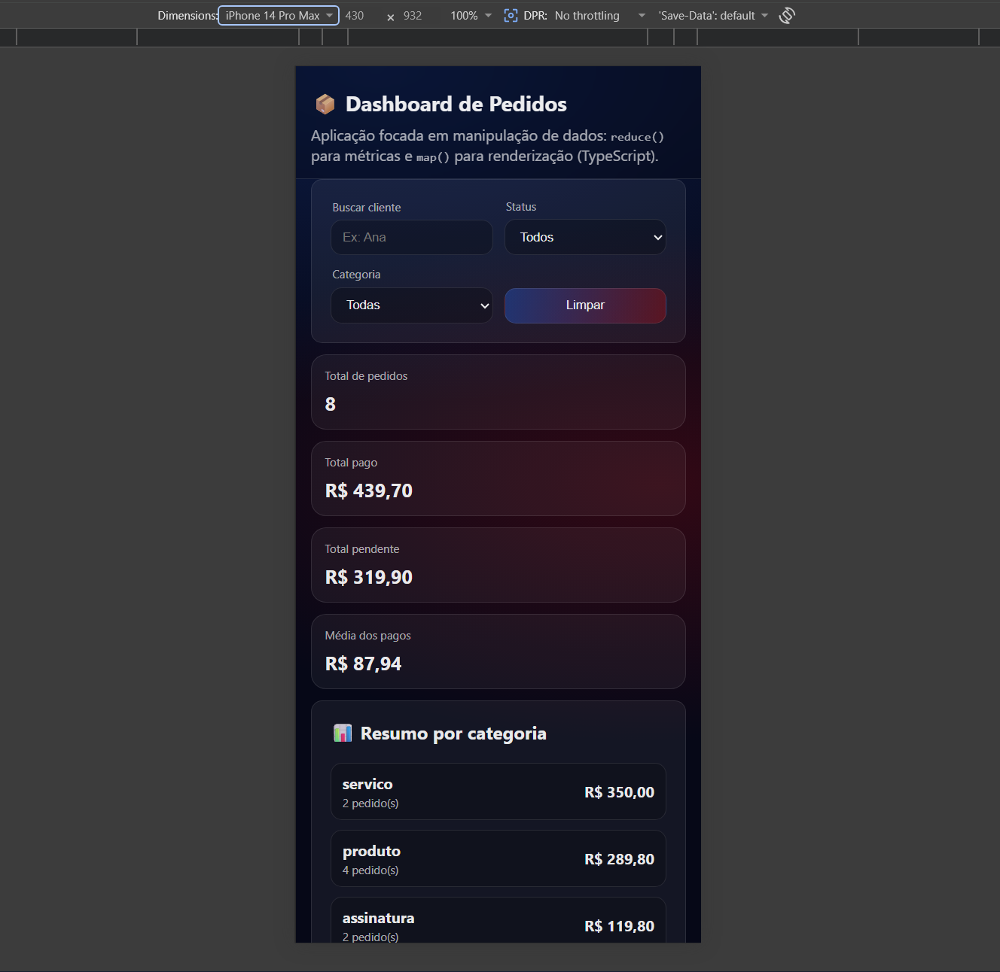
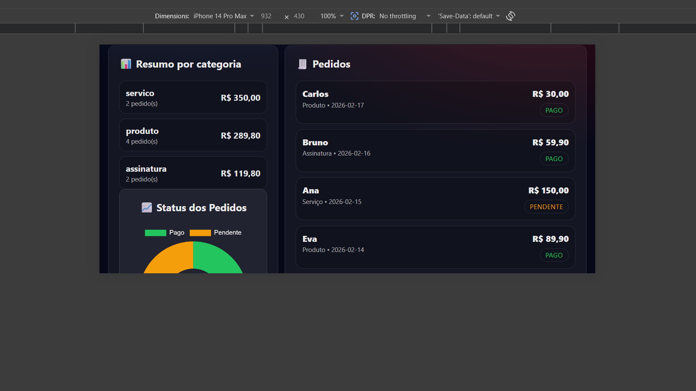

# 📦 Dashboard de Pedidos

[🚀 Ver Demonstração Online](https://maiconsouzazzss.github.io/dashboard-pedidos-ts/)

Este projeto é uma aplicação de análise de pedidos desenvolvida para praticar a manipulação avançada de dados com **TypeScript**. O objetivo principal foi criar um painel que consolida informações de maneira reativa, permitindo filtragem rápida e visualização clara de métricas financeiras.

## 🛠 Principais Desafios Técnicos
Diferente de uma simples lista, este dashboard resolveu os seguintes problemas:
- **Agregação de Dados:** Implementei o uso de `reduce()` para calcular totais de forma eficiente, evitando loops desnecessários.
- **Tipagem com TypeScript:** Defini interfaces precisas para os objetos de `Pedido`, garantindo que qualquer manipulação de dados seja segura e previsível.
- **Ciclo de Vida do Gráfico:** Gerenciei a instância do `Chart.js` para que o gráfico seja destruído e recriado corretamente a cada novo filtro, evitando o erro comum de "overwriting" ou vazamento de memória.

## 🚀 Stack de Desenvolvimento
- **Core:** TypeScript, JavaScript (ES6+).
- **Interface:** HTML5, CSS3 (foco em Flexbox e responsividade).
- **Bibliotecas:** Chart.js para a representação visual dos dados.

## 📸 Visual do Projeto
*O layout foi desenhado para ser totalmente responsivo, garantindo leitura clara em telas mobile e desktop.*

**Visão Desktop:**


**Visão Mobile (Vertical):**


**Visão Mobile (Horizontal):**


## 💡 O que aprendi neste projeto?
Este projeto me ajudou a consolidar conceitos fundamentais de **Programação Funcional**. A decisão de utilizar `filter`, `map` e `reduce` em conjunto tornou o código muito mais legível e profissional do que se tivesse utilizado laços `for` tradicionais.

## 💻 Como rodar
Para rodar este projeto localmente em sua máquina, siga os passos abaixo:

1. **Clone o repositório:**
   ```bash
   git clone [https://github.com/Maiconsouzazzss/dashboard-pedidos-ts.git](https://github.com/Maiconsouzazzss/dashboard-pedidos-ts.git)